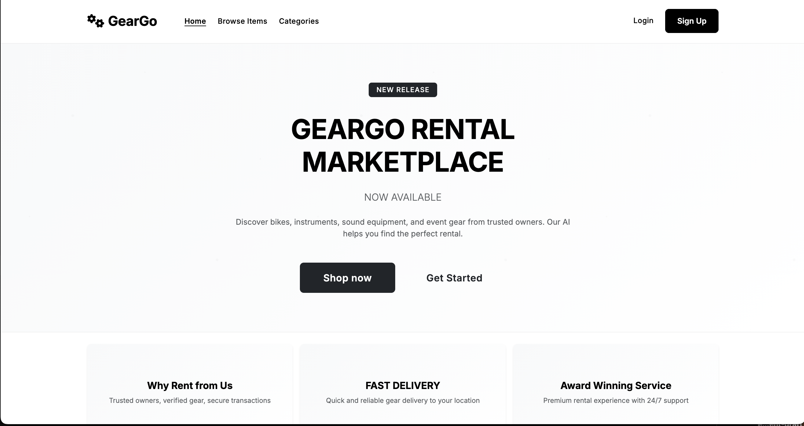

# GearGo - AI-Powered Rental Marketplace

GearGo is a rental marketplace for bikes, instruments, and sound equipment. The platform connects owners who want to rent out their gear with renters looking for affordable, flexible rentals.

## Screenshots

<div align="center">
  
  <p><em>Home Page - Browse available gear and services</em></p>
</div>

<div align="center">
  
  <p><em>Item Listing - Search and filter rental items</em></p>
</div>

<div align="center">
  
  <p><em>User Dashboard - Manage your rentals and bookings</em></p>
</div>

> **Note:** Add your screenshot images to the `screenshots/` directory. Supported formats: PNG, JPG, JPEG, GIF

## Phase 1 Implementation Status ✅

### What's Been Implemented:

#### Core Foundation (Weeks 1-4)
- ✅ Django project setup with PostgreSQL configuration
- ✅ User authentication and profile management
- ✅ Core models (User, Profile, Category, Item, Booking, Review)
- ✅ Django admin interface
- ✅ Basic project structure and configuration

#### Features Implemented:
- **User Management**: Registration, login, profile management with membership tiers
- **Product Listings**: Item creation, editing, and management with categories
- **Basic UI**: Responsive Bootstrap-based interface with navigation
- **Admin Interface**: Full admin panel for managing users, items, and bookings
- **Database**: SQLite for development (PostgreSQL ready for production)

### Quick Start:

## Quick Start

### Option 1: Docker (Recommended)

1. **Clone the repository**
   ```bash
   git clone <repository-url>
   cd geargo
   ```

2. **Build and start services**
   ```bash
   make build
   make up
   ```

3. **Set up the application**
   ```bash
   make setup
   ```

4. **Create superuser (optional)**
   ```bash
   make superuser
   ```

5. **Visit the application**
   - Main site: http://127.0.0.1:8000
   - Admin interface: http://127.0.0.1:8000/admin

### Option 2: Local Development

1. **Clone the repository**
   ```bash
   git clone <repository-url>
   cd geargo
   ```

2. **Set up virtual environment**
   ```bash
   python3 -m venv venv
   source venv/bin/activate  # On Windows: venv\Scripts\activate
   ```

3. **Install dependencies**
   ```bash
   pip install -r requirements.txt
   ```

4. **Run migrations**
   ```bash
   python manage.py migrate
   ```

5. **Set up initial data**
   ```bash
   python manage.py setup_initial_data
   ```

6. **Run the development server**
   ```bash
   python manage.py runserver
   ```

7. **Access the application**
   - Main site: http://127.0.0.1:8000
   - Admin panel: http://127.0.0.1:8000/admin
   - Test login: test@geargo.com / testpass123

## Docker Commands

Use the Makefile for common operations:

```bash
# Show all available commands
make help

# Start all services
make up

# Stop all services
make down

# View logs
make logs

# Run migrations
make migrate

# Setup everything
make setup

# Create superuser
make superuser

# Clean everything
make clean

# Fresh start
make reset
```

### Current Features:

- **Home Page**: Hero section with featured items and categories
- **Item Browsing**: Search and filter items by category
- **User Profiles**: Extended user profiles with membership tiers
- **Admin Panel**: Complete admin interface for data management
- **Responsive Design**: Mobile-friendly Bootstrap interface

### Next Steps (Phase 2):
- Booking system implementation
- Payment integration with Stripe
- Email notifications
- User dashboard improvements

### Tech Stack:
- **Backend**: Django 5.2.5 + Django REST Framework
- **Database**: SQLite (dev) / PostgreSQL (prod)
- **Frontend**: Bootstrap 5 + Font Awesome
- **Authentication**: Django Allauth with social login support
- **File Upload**: Pillow for image handling

---

*GearGo also includes a Service Marketplace where users can hire tech experts along with their rentals.* 
